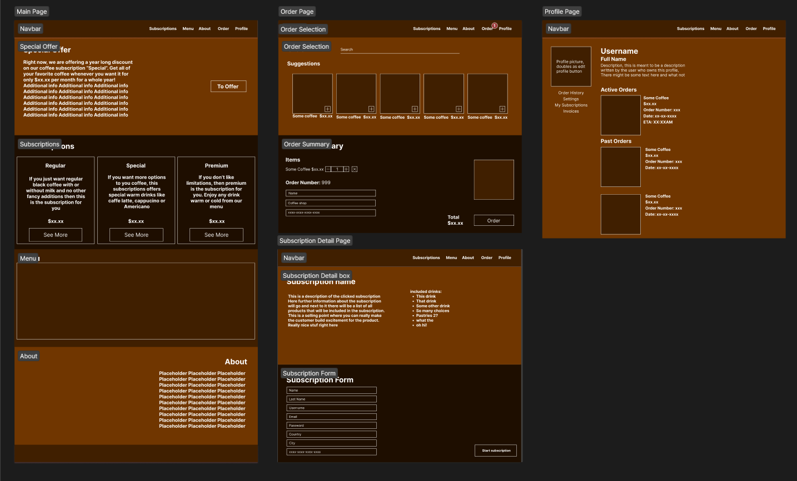
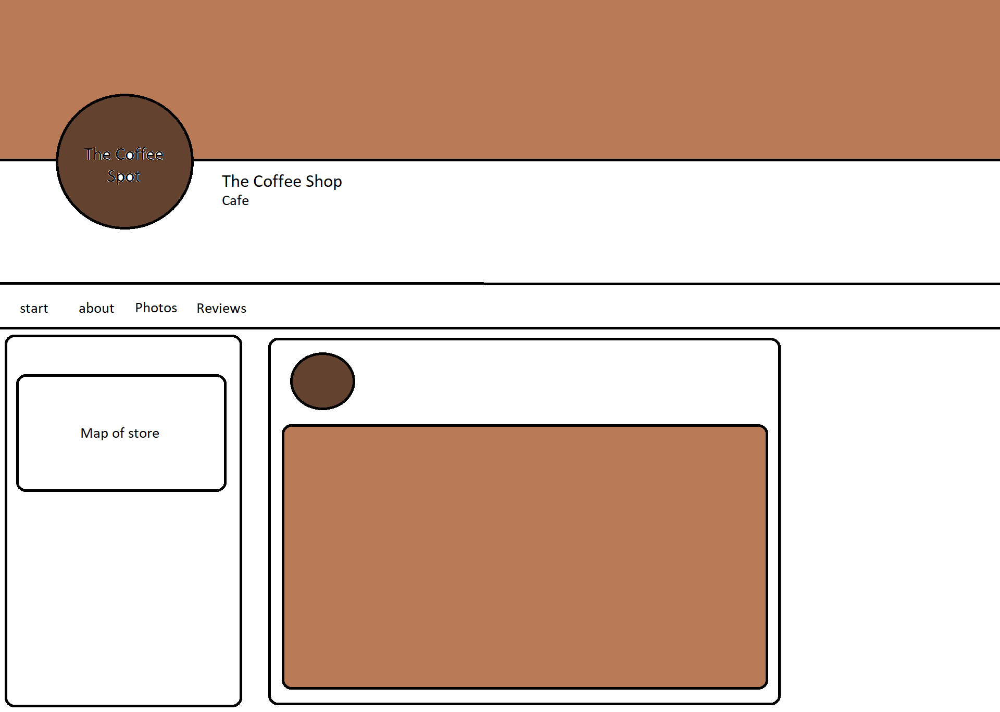

# The Coffee Spot

The Coffee Spot is an online web application that lets you order coffee from a The Coffee Spot coffee shop. It is in this application that you can sign up for a subscription so that you can order at much coffee as you like

[link to deployed website](https://the-coffee-spot.herokuapp.com/)

## Contents

* [User Experience](#user-experience)
    * [User stories](#user-stories)
* [Business Model](#business-model)
* [Marketing](#marketing)
* [Agile Methods](#agile-methods)
* [Design](#design)
    * [Early Stage(wireframe)](#early-stage)
    * [Color Scheme](#color-scheme)
    * [typography](#typography)
    * [imagery](#imagery)
* [Features](#features)
    * [Navbar](#navbar)
    * [Home page](#home-page)
    * [Subscription detail](#subscription-page)
    * [Order page](#order-page)
    * [Customzie Product](#customize-product-page)
    * [Product detail](#product-details-page)
    * [Profile page](#profile-page)
    * [Create Product](#create-product-page)
* [Technologies Used](#technologies-used)
    * [Languages](#languages-used)
    * [Frameworks, libraies & programs used](#frameworks-libraries--programs-used)
    * [Database](#databases)
* [Deployment & Local Development](#deployment--local-development)
    * [Initial Deployment](#initial-deployment)
    * [Deployment](#deployment)
    * [Environment Variables](#environment-variables)
* [Testing](#testing)
* [Credits](#credits)
    * [Code used](#code-used)
    * [Media](#media)

## User Experience

### User Stories

* As a user I can create an account and log in aswell as log out
* As a user I can view subscriptions to see which one fits me the most. I can then subscribe with a monthly fee. I can also change or cancel a subscription if it, despite choice, does not fit me.
* As a user I can search for what coffee I would like to order or view the list of products or in the menu part of the home page.
* As a user, once I have chosen what product I am ordering, I can create an order by filling out the details. I can also cancel the order while it is active. 
* As a user I can view previous orders that I have made when viewing my profile page.
* As a user I can view the current subscriptions that I have active by viewing my progile page.

### User Experience Goals

The goal is to create an environment for the user that is so easy to use that they could use it multiple times a day if the user so wishes. The users objective will most likely be to subscribe or order, therefor the functionality is based around just that. The user should not have to go between pages in order to complete that task, it should all be condensed in one place for simplicitys sake. 

## Design

The Coffee spot has many features. alot of these features are located in the same place to make them easily accessible by the user. For example, alot of the information regarding special offers, subscriptions, menu items and general information about the page can be found right at the home page. This is all to avoid the hassle of having to go back and forth between pages in order for the user to complete a specific task. The site is minimal in its design so that it does not overstimulate the user with images and unecessary design features. The application is a tool that is meant to be used often or as frequently as the user will want the product.

### Early Stage

The early blueprints of the coffee spot was made using [Figma](https://www.figma.com/).

### Color Scheme

The coffee spot favors brown color to remind users of coffee. The website does not focus a whole lot on images but uses different shades of brown to separate sections on the pages. The admin does have the ability to set images to the products on creation.

### Typography

The Coffee shop uses the google [Pacifico](https://fonts.google.com/specimen/Pacifico) 

The Coffee shop also uses the [Bootstrap5 typography](https://getbootstrap.com/docs/5.0/content/typography/)

### Imagery

The coffee spot does not use a lot of images, it uses a a image of a coffee cup image on order items and subscriptions to further push the coffee narative. 

### Order page Design

Order page has a unique design choice inspired by streaming websites (oddly enough) that allows users to scroll horizontally to view products. They also have the option to search. The idea is to not display the checkout part of the page until the user has chosen their products. It is supposed to function as an all in one solution so that you don't have your store and cart separate. 

## Business Model

The coffee spot uses a mix of B2C and subscription based business model.

The website is intended to be used by individuals and not companies. The consumer uses the website to place an order for a drink beforehand so that the product is ready when the consumer arrives at the cafe.

The consumer can also choose to sign up for a subscription. In the subscriptions certain products are included in a monthly cost depending on what subscription you sign up for. For instance, subscription "regular" lets you order drinks that fall under the category "regular" free of charge since they are included in the monthly cost. 

The shop allows users to select between a variety of warm and cold drinks with three different subscription categories, regular, special and premium

## Marketing

The coffee shop has its own Facebook page which is intended to be used as a marketing strategy. Here we can post news, promote campaigns, and let users interact and share their experiences with others. By keeping customers in the loop we hope to inscentivise customers return but also get noticed by potential new customers aswell

## Agile Methods

Agile methods were used to create this project. The implementation of user stories were recorded using githubs "projects" section and githubs own kanban board. Each user story was created in the "todo" section. When a user story was being worked on, it was moved to the "in progress" section. When a user story was finished it was moved to the "done" section.

[link to kanban board](https://github.com/users/KevJohBer/projects/6/views/1)

## Features

### Navbar

The Coffee Spot website has a navbar that can be accessed on every template. It allows the users to

* Access the home page by clicking the logo
* Access the subscriptions part of the home page by clicking "subscriptions"
* Access the menu part of the home page by clicking "Menu"
* Access the about part of the home page by clicking "about"
* Access the login and logout templates by clicking login or logout

The navbar also contains another link named "create product" that allows admin to access the "create product" template.

### Home Page

The first page that you are greeted with when opening the Coffee Spot is the home page. The home page consists of four sections.
* special offer
* subscriptions
* menu
* about
These sections are supposed to help the user find what they are looking for. The navbar helps navigate through these sections aswell.

At the top of the page you will find a special offer. It has some information about the one year discount on a subscription and also features a button which takes you to that specific subscription. Right below it is the subscriptions section. Here, if the special offer was not good enough, you can look at the other subscriptions and see if they are more in alignment with the product you are looking for. After the subscriptions section, you can find the menu, which is a list of all the products that are included in the menu. From here you can decide what you would like to order. And at the bottom of the page is the about section. Here you can find a text about the website and its history.

### Subscription page

By selecting one of the subscriptions on the home page by clicking "see more" you can view more details about the subscription, price information and what drinks are included in it. At the bottom of the subscription page is a form. The idea is to fill this form out to get yourself subscribed. The invoices start on the same day that you sign up. 

### Order page 

The order page features a search bar that let's you search for specific drinks to make it easier for users to find what they are looking for. 

If users prefer to browse, they have the horizontal scroll bar that let's you browse through the drinks. For every drink there are 3 butons "+", "customize" and "details". Clicking "+" will add the product to the cart, clicking "customize" will take you to the product customization page" and clicking "details" will take you to the product details page.

Once you add a drink to your order, a form will appear and you can enter your credit card information and finish your order. You can also choose which address you would like to pick up the finished coffee from. Although there are only three addresses currently. Once you have filled out the form and created your forum, you will be redirected to a confirmation page where you can view the details of your order. 

For the admin, there is an edit and delete button on each product. The edit button will let you edit the information of all products. The delete button will let you delete the product from the database entirely. 

### Customize product page

The customize product page allows a user to customize the item they want to buy. They get to choose among 3 additions to their drink "Extra Espresso Shot", "Vanilla syrup" or "Caramel Syrup" if the user so would like to add them. The additions cost an extra $1 each which is then added to the order total. users can also choose what size they want their drink to be, "small" or "standard". Finally users can choose what type of milk they want in their drink. They can choose between "milk", "non lactose milk", "Oat milk", "Soy Milk" and "coconut milk".

### Product details page

The product details page displays all information that you would want to know about your drink like a description of the drink, the ingredients, category, price and even the rating on the drink.

The product details page also allows users to rate the drink from 1 to 5.

### Profile page

The Profile page can be viewed by clicking "profile" on the navbar. The profile page has your own profile image displayed along with your name and your own personalized description. Clicking your profile image will let you edit your profile. Here you can edit your default order information. Below your profile image, you have a set of links which can help you find various information. You have a link for order history, which displays your previous orders, aswell as your active orders. If the order is active, you can cancel the order with a press of a button. You can also view your subscriptions so that you always know what subscription you have active. You can even cancel the subscription in in the same view. You can view your subscription invoices with the invoices link. 

### Create Product Page

If you are logged in as an admin, you can view the create product page by clicking "Create Product" on the navbar. The create product page is just a form that lets you enter a name, price, category and image of whatever product you would like to add. The products will automatically appear on the menu on the home page and will also appear in the coffee selection on the order page. 

### Future implementations

* Editable subscriptions, admin should have the ability to change subscriptions to add discounts and let it include other drinks
* Advanced form handling. Users should not be able to have accounts with fake or inappropriate information
* More details on addresses. When you make an order you get to pick 3 addresses in stockholm but you it would be nice to have a visual that lets you know more about the address
* Admin should be able to add addresses to the address list and there should be more addresses to choose from.

## Technologies Used

### Development

* Gitpod, VScode and CodeAnywhere was used to write and test the code.
* The website was debugged using chrome devtools
* Source code is in a Github repository
* Heroku was used for deploying the project
* Wireframes were made using Figma
* Font Awesome was used to display icons
* Google fonts were used for typography
* Amazon Web Services was used to store static and media files

### Languages Used

* HTML
* CSS
* Python
* Javascript

### Frameworks, libraries & Programs Used

* Django Web Framework
* Bootstrap 5
* Stripe
* Stripe.js
* pylint
* Django-allauth
* Pillow
* Boto3
* Djago-storages
* gunicorn
* Django-cirspy-forms
* Dj-database-url
* Psycopg2-binary
* jQuery

Here is a link to [requirements](requirements.txt)

### Databases
The data base is stored using ElephantSQL instance.

## Deployment & Local Development

### Initial Deployment

Heroku was used to deploy the live website

1. Login to Heroku
2. In the dashboard click your already created application
3. Click the deploy tab
4. Click the github icon and select the corresponding github repository
5. Enter your github credentials

### deployment

1. Scroll down to "Manual deploy
2. Select "main" as the branch you want to deploy to
3. click "Deploy Branch"

### Environment Variables

* AWS_ACCESS_KEY_ID
    * Obtained from amazon webservice s3 bucket
* AWS_SECRET_ACCESS_KEY
    * Obtained from amazon webservice s3 bucket
* EMAIL_HOST_PASS
    * This can be obtained from your gmail account
* EMAIL_HOST_USER
    * This can be obtained from your gmail account
* SECRET_KEY
    * This secret key was obtained with this [secret key generator](https://djecrety.ir/)
* STRIPE_PLAN_PREMIUM
* STRIPE_PLAN_REGULAR
* STRIPE_PLAN_SPECIAL
* STRIPE_PUBLIC_KEY
* STRIPE_SECRET_KEY
    * Stripe variables can be obtained from your store on Stripe
* DATABASE_URL
    * This variable can be found by creating a database with ElephantSQL

## Testing

All testing can be found [here](TESTING.md)

## Credits

### Code Used

The Product and Order models were inspired by the CI Boutique Ado tutorial

The subscriptions were made with help of this [tutorial](https://www.youtube.com/watch?v=Bq5lR5WQNOw)

Having profile models with default information was also inspired by the CI Boutique Ado project

The code for making search queries was taken from CI Boutique Ado tutorial

### Media

Coffee cup image was taken from [cityPNG](https://www.citypng.com/photo/21638/coffee-cup-tea-white-silhouette-icon-transparent-png)

The email newsletter signup image was taken from [copenhagen brew](https://copenhagenbrew.dk/sv/blogs/altomkaffe/den-store-guide-til-latte-art)
