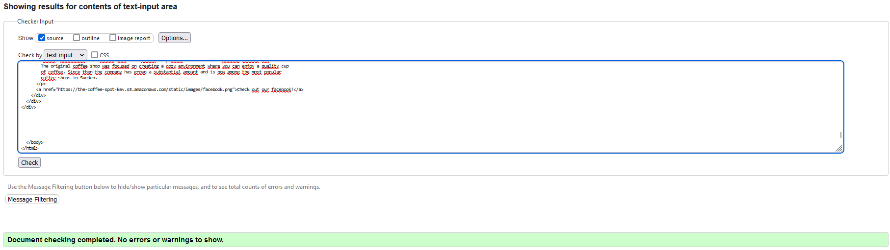
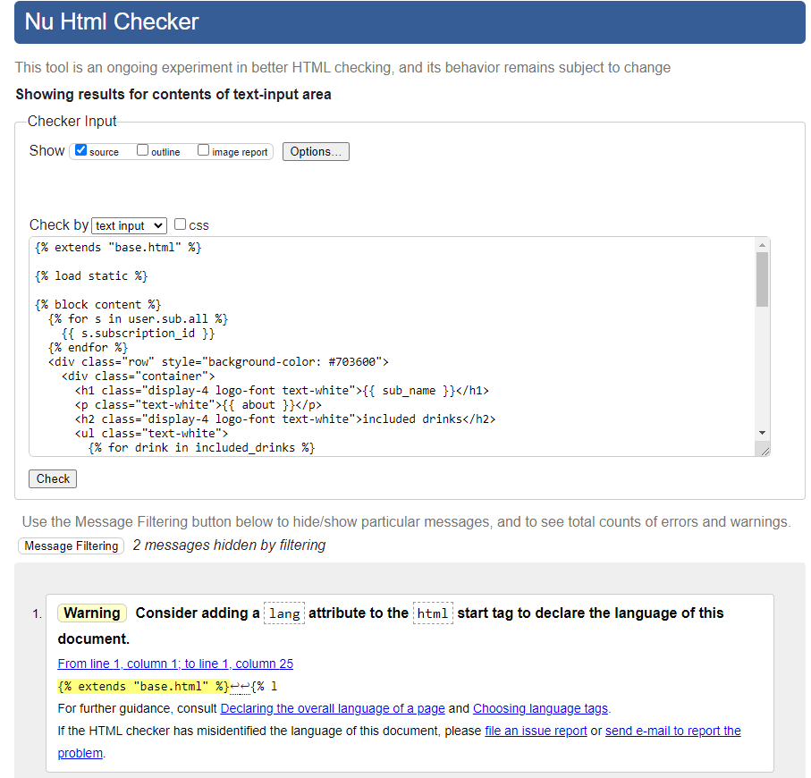
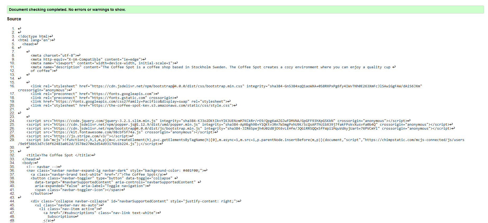
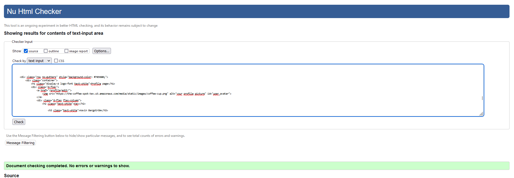
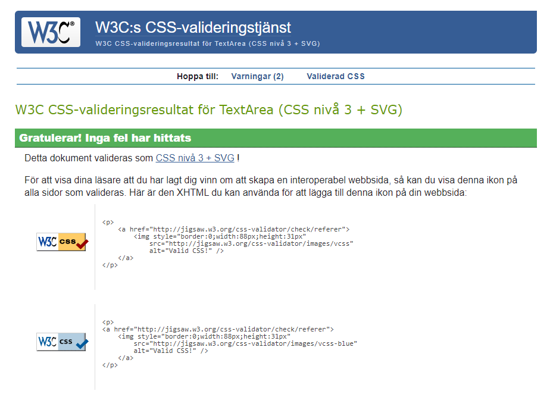
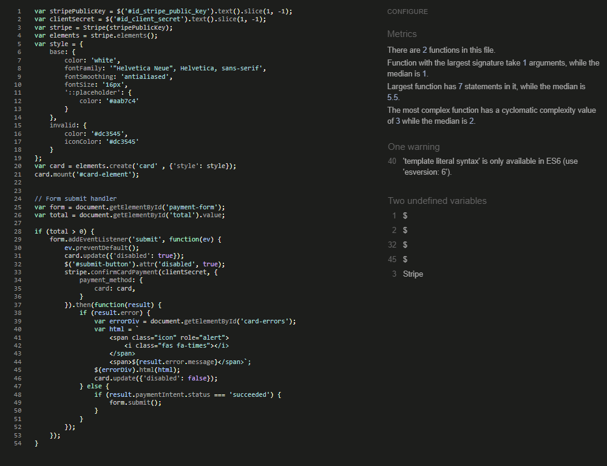
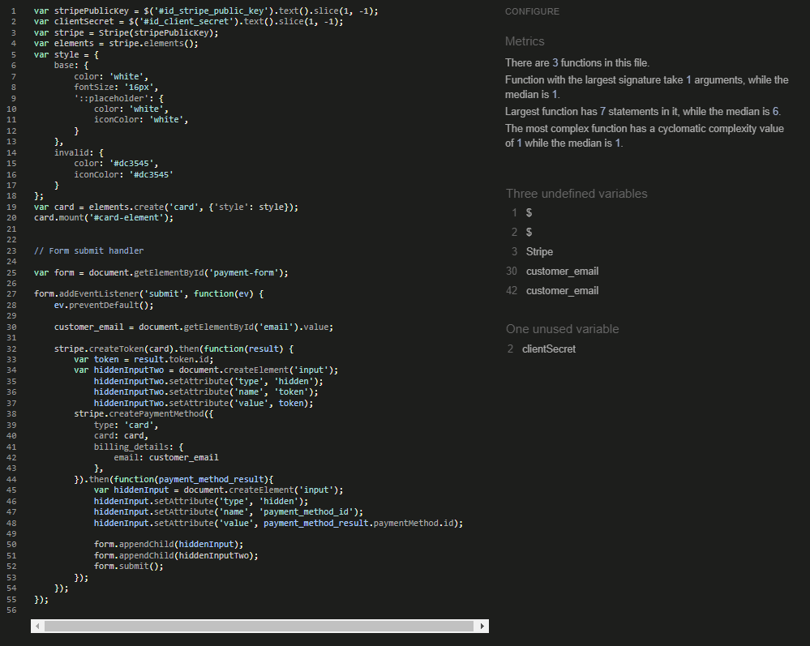
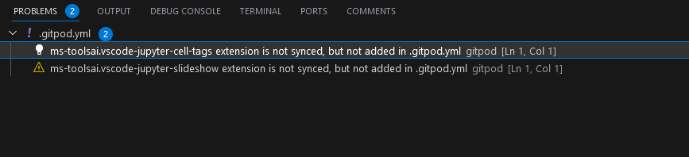
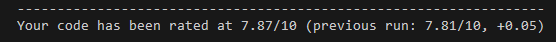
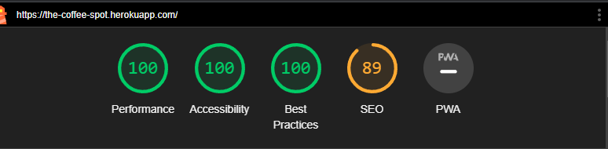

# The Coffee Spot Testing

## Contents

* [Automated Testing](#automated-testing)
    * [HTML](#html)
    * [CSS](#css)
    * [JS](#javascript)
    * [Python](#python)
* [Manual Testing](#manual-testing)
    * [Testing User Stories](#testing-user-stories)
* [Bugs](#bugs)
* [Unfinished Features](#unfinished-features)
* [Testing Devices](#testing-devices)

## Automated Testing

### HTML

HTML was validated using the W3C Markup Validation Service

Subscription detail was success apart from the django template language.

Order page was success apart from the django template language.

Profile page was a success apart from hte django template language

### CSS

CSS was validated using W3C Jigsaw

### Javascript

Javascript was tested using jshint

### Python

Python was tested using pycodestyle, I still had these two problems but they seem to be an issue with gipod rather than the sites code

Python was also partially tested using pylint where it scored 7.87, pylint also checks migration files which is why it still might not pass, furthermore pylint suggests that django.forms imports were not used eventhough they were.

### Responsiveness

Responsiveness was tested using Chrome Lighthouse

## Manual Testing

### Testing User Stories

| Goal | How are they achieved? | pass (yes/no) |
|:---|:---|:---|
| Users should be able to access the home page esily| this is acheived by clicking the logo on the navbar| yes |
| Users should be able to access the menu esily| this is acheived by clicking the "menu" on the navbar | yes |
| Users should be able to access the about section esily | This is acheived by clicking "about" on the navbar | yes |
| Users should be able to access the order page | by clicking "order" on the navbar | yes |
| Users should be able to login and logout | This is achevied by clicking login or logout on the navbar | Yes |
| Users should be able to get more information about specific subscriptions | This is acheived by clicking "see more" on the subscription section on the home page. | yes |
| Users should see what drinks are included in their subscription | This is acheived by adding a list of all products included in the subscription detail page | yes |
| Users should be able to sign up for a subscription | This is acheived by filling out the form on the subscription page | yes |
| Users should be able to view products | In the order page there is a selection of coffees to choose from aswell as a search bar | yes |
| Users should be able o make an order | When the user has chosen the product they want to purchase, they get to fill out the order details and create an order | yes |
| Users should be able to customize their product | When the user clicks customize on a product and fills out the form | yes |
| Users should be able to see more information about their products | By clicking details on a product | yes |
| Users should be able to rate a product | When the user is in the product detail page and presses a rating | yes |
| Users should be met with an error message if the form is invalid | this is acheived with form handling | yes |
| Users should get some notification that their order is complete | When the users submits the form they get redirected to a order success page | Yes |
| Users should receive further confirmation | an email should be sent after every order | No |
| users should be able to view their own orders, subscriptions and information | This is acheived by having a profile page | yes |
| Users should be able to edit their profiles | this is acheived by clicking the profile image which takes you to a form in which you can change your information | Yes |
| Users should be able to check their order histories | Users can do this by clicking "view order history" in the profile page | yes |
| Users should be able to cancel active orders | this is acheived by clicking cancel order on the profile/order_history page | yes |
| Users should be able to check what subscriptions they have | this is acheived by clicking "view subscriptions" on the profile page | yes |
| Users should be able to cancel their subscriptions | Users can do this by clicking cancel subscription | yes |
| Users should be able to change settings on the website | Users can do this by clicking "settings" on the profile page | No |
| Users should be able to check on their previous and active invoices | Users can do this by clicking "view invoices" on profile page | no |
| Admins should be able to create new products | This is acheived by clicking "create product" on the navbar | yes |
| Admins should be able to edit products | This is acheived by clicking "edit" on any product on the order page | yes |
| Admins should be able to delete proudcts | This is acheived by clicking "delete" on any product on the order page | yes |

## Bugs

* If you enter invalid data on the subscription detail page the error message will remain even after exiting the website.
* Choosing an addition on the customize product page will reset milk and size.
* You get console errors on order page because the site is listening for elements that arent't displayed until you add an item to the cart.

## Unfinished Features

* The order details is supposed to show you when your coffee is ready but it is currently displaying the time the order was created.
* The order details and confirmation is supposed to show you what additions you added to the drinks.
* Changing the billing info on your profile page is supposed to change it for the subscription billing aswell.
* If you have customized billing info on profile then creating a subscription should fill out the fields for you. 

## Testing Devices

Testing was performed with the following devices:

* Personal Computer
    * Acer Predator PO3-620
    * MacBook Pro 2020
* Mobile device
    * Iphone SE (2022)

Tests were done using the following browsers:

* Microsoft Edge
* Google Chrome
* Safari